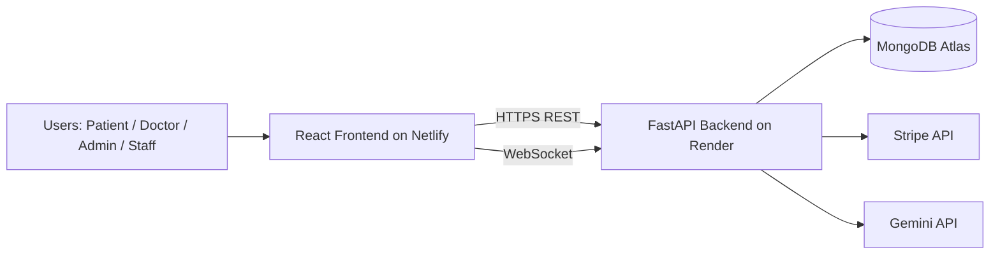
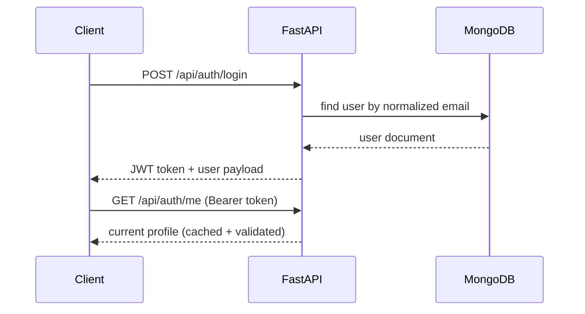
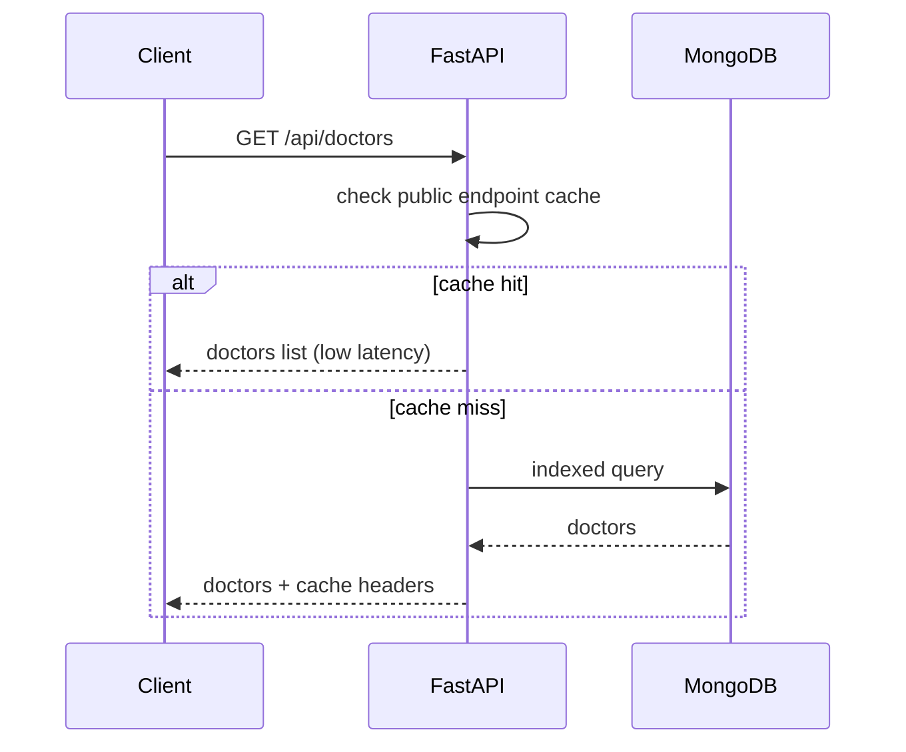
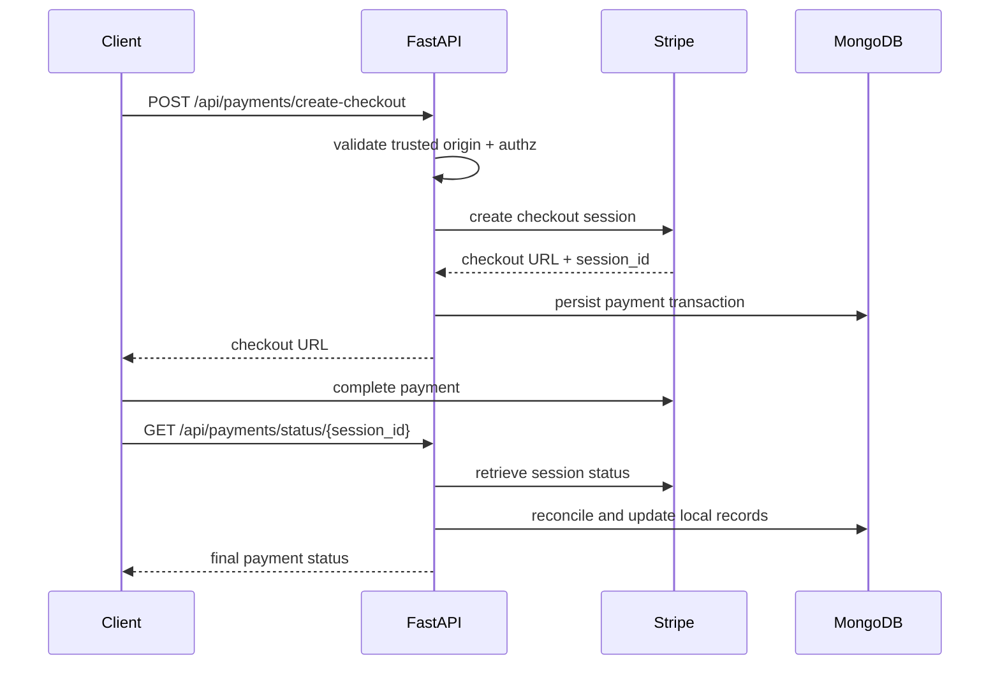
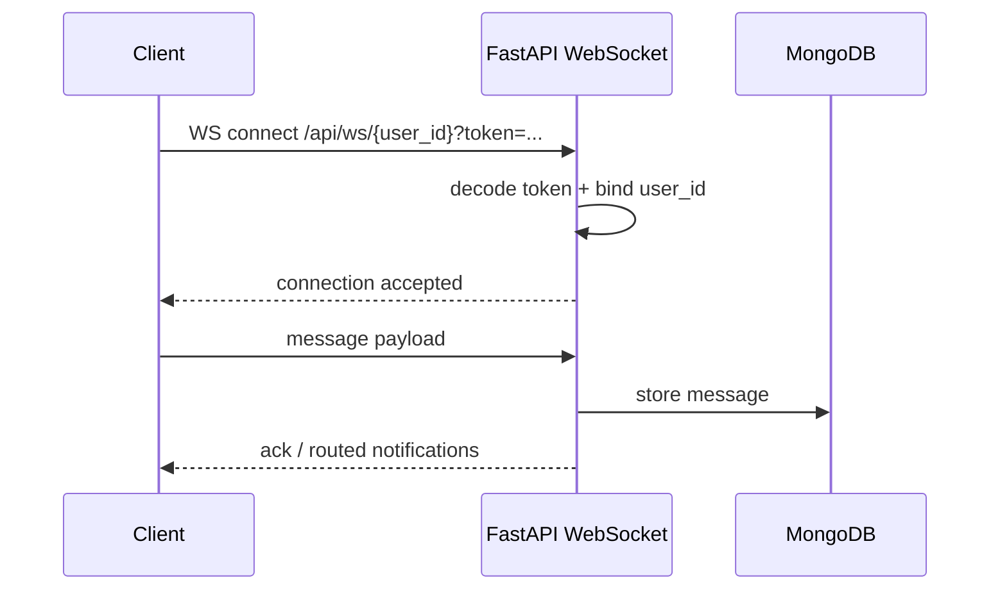

# Nirmaya Health Services

<p align="center">
  Care-centered digital hospital platform for patients, doctors, operations teams, and administrators.
</p>

<p align="center">
  
</p>

<p align="center">
  <a href="https://nirmaya-health-services.netlify.app"></a>
  <a href="https://nirmaya-health-backend-2026.onrender.com/api/health"></a>
  
  
  
</p>

<p align="center">
  <a href="https://nirmaya-health-services.netlify.app">Live Frontend</a>
  -
  <a href="https://nirmaya-health-backend-2026.onrender.com/api/health">Live Backend Health</a>
  -
  <a href="https://github.com/RSaha0507/Nirmaya-Health-Services/issues">Issues</a>
</p>

<p align="center">
  <em>Built to make healthcare workflows feel calm, reliable, and human at scale.</em>
</p>

---

## Table Of Contents
- [Platform Snapshot](#platform-snapshot)
- [Salient Features](#salient-features)
- [Architecture At A Glance](#architecture-at-a-glance)
- [Core Workflows](#core-workflows)
- [Security And Runtime Hardening](#security-and-runtime-hardening)
- [Tech Stack](#tech-stack)
- [API Surface (Domain Map)](#api-surface-domain-map)
- [Repository Structure](#repository-structure)
- [Local Development](#local-development)
- [Environment Variables](#environment-variables)
- [Build, Deploy, Verify](#build-deploy-verify)
- [Testing And Health Checks](#testing-and-health-checks)
- [Roadmap](#roadmap)
- [Contributing](#contributing)
- [License](#license)
- [Contact](#contact)
- [Acknowledgements](#acknowledgements)
- [Closing Note](#closing-note)

---

## Platform Snapshot
Nirmaya Health Services is a full-stack healthcare operations platform that connects:
- patients (appointments, reports, packages, payments),
- doctors (portal, schedules, communication),
- operations staff (inventory, beds, ambulance, lab),
- administrators (analytics, users, governance).

The platform is built as a React frontend and FastAPI backend with MongoDB Atlas, Stripe integration, and authenticated WebSocket messaging.

### Why this project feels different
- It is not just a booking app; it models day-to-day hospital operations.
- It balances product experience and engineering depth in one codebase.
- It is built with practical production concerns in mind: security, latency, and observability-ready workflows.

---

## Salient Features

### Multi-role product surface
- Patient journeys: registration/login, doctor discovery, booking, payments, reports.
- Doctor workflows: dashboard, patient interactions, prescription flow, communication.
- Operations workflows: bed management, inventory usage/restock, shift coordination.
- Admin workflows: user management, operational analytics, master data controls.

### Performance-focused runtime
- Backend gzip compression and tuned Mongo connection pooling.
- Startup index creation for hot query paths.
- Public endpoint response caching with TTL + stale-while-revalidate.
- Frontend in-memory cache + persisted session cache + in-flight GET dedupe.
- Idle prefetch for hot catalogs (doctors, equipment, departments, packages).
- Netlify static asset caching policy for immutable hashed bundles.

### Security-focused defaults
- JWT auth with role and ownership authorization.
- Strict CORS allowlist normalization (no wildcard credentials pattern).
- `/api/seed` and demo payment routes gated by env flags.
- WebSocket handshake auth with user-token binding.
- Report URL sanitization and optional host allowlist.
- Trusted origin enforcement for Stripe redirect URLs.

### Delivery-ready routing model
- Path-first navigation model with deep-link support (`/doctors`, `/equipment`, `/dashboard`, etc.).
- Netlify redirect rules ensure all app routes hydrate from `index.html`.

---

## Architecture At A Glance



### Runtime layers
1. Edge + static delivery: Netlify serves build artifacts with cache headers.
2. Application layer: React app handles UX, route-state mapping, API orchestration.
3. API layer: FastAPI enforces authn/authz, validation, and business workflows.
4. Data layer: MongoDB stores core entities and transaction records.

---

## Core Workflows

### 1) Authentication flow


### 2) Doctor discovery flow


### 3) Payment checkout flow


### 4) Realtime messaging flow


---

## Security And Runtime Hardening

### Security controls currently implemented
- Env-gated sensitive routes:
  - `ENABLE_SEED_ENDPOINT` (default off),
  - `ENABLE_DEMO_PAYMENT_ROUTES` (default off).
- Authz controls:
  - role checks for admin/staff routes,
  - ownership checks for payment access.
- CORS controls:
  - normalized allowlist,
  - explicit methods/headers,
  - credential wildcard behavior blocked.
- WebSocket handshake:
  - token required,
  - token user must match route user.
- Input sanitization:
  - strict report `file_url` validation,
  - optional host allowlist via env.

### Performance controls currently implemented
- GZip middleware for response compression.
- Startup index creation for common query patterns.
- Auth user short-TTL cache (`AUTH_USER_CACHE_TTL_SECONDS`).
- Public catalog short-TTL cache (`PUBLIC_ENDPOINT_CACHE_TTL_SECONDS`).
- Frontend API client:
  - response cache,
  - session persisted cache for hot endpoints,
  - inflight request dedupe.
- Idle prefetch for catalog pages.
- Static asset caching policy in `frontend/public/_headers`.

---

## Tech Stack

### Frontend
| Package | Version | Role |
|---|---:|---|
| `react` | `19.1.1` | UI runtime |
| `react-dom` | `19.1.1` | DOM rendering |
| `react-scripts` | `5.0.1` | Build tooling |
| `tailwindcss` | `3.4.1` | Utility styling |
| `recharts` | `3.6.0` | Analytics charts |
| `lucide-react` | `0.539.0` | Icon system |
| `date-fns` | `4.1.0` | Date utilities |

### Backend
| Package | Version | Role |
|---|---:|---|
| `fastapi` | `0.115.6` | API framework |
| `uvicorn` | `0.34.0` | ASGI server |
| `motor` | `3.7.0` | Async Mongo driver |
| `pymongo` | `4.11.3` | Mongo toolkit |
| `PyJWT` | `2.10.1` | JWT signing/verification |
| `bcrypt` | `4.2.1` | Password hashing |
| `httpx` | `0.28.1` | Async HTTP client |
| `websockets` | `14.1` | Realtime transport |
| `stripe` | `14.2.0` | Payment gateway |

### Infrastructure
- Frontend hosting: Netlify
- Backend hosting: Render
- Database: MongoDB Atlas

---

## API Surface (Domain Map)

### Core domains
- Health + bootstrap: `/api/health`, `/api/departments`
- Identity: `/api/auth/*`
- Doctors + appointments: `/api/doctors*`, `/api/appointments*`
- Payments:
  - legacy/demo routes: `/api/payments/initiate`, `/api/payments/verify`, `/api/payments/simulate`
  - Stripe routes: `/api/payments/create-checkout`, `/api/payments/status/{session_id}`, `/api/payments/history`
- Operations: `/api/inventory*`, `/api/shifts*`, `/api/beds*`, `/api/ambulance*`, `/api/lab-tests*`
- Clinical records: `/api/reports*`, `/api/prescriptions*`, `/api/health-records*`
- Communication: `/api/messages*`, `/api/ws/{user_id}`
- Analytics: `/api/analytics/patient`, `/api/analytics/doctor`, `/api/analytics/operations`, `/api/analytics/admin`
- Administration: `/api/users`, `/api/patients`, `/api/users/{user_id}`

### API style
- JSON REST over HTTPS.
- Bearer token auth on protected routes.
- WebSocket channel for realtime events.

---

## Repository Structure

```text
Nirmaya-Health-Services/
|-- backend/
|   |-- server.py                # FastAPI app, routes, authz, caching, websocket
|   |-- requirements.txt         # Python dependencies
|   `-- seeds/                   # Seed catalog data
|-- frontend/
|   |-- src/
|   |   |-- MainApp.js           # Main app runtime and route orchestration
|   |   |-- AdditionalPages.js   # Additional service pages
|   |   `-- services/apiClient.js# API client, token + cache + safe URL helpers
|   |-- public/
|   |   |-- _headers             # Netlify cache-control policy
|   |   `-- _redirects           # Deep-link route mapping
|   `-- package.json             # Frontend dependencies and scripts
|-- render.yaml                  # Render backend blueprint
`-- README.md
```

---

## Local Development

### Prerequisites
- Node.js 18+ (recommended)
- Python 3.10+ (recommended)
- MongoDB Atlas connection string
- Stripe secret key (for checkout flow testing)

### 1) Clone
```bash
git clone https://github.com/RSaha0507/Nirmaya-Health-Services.git
cd Nirmaya-Health-Services
```

### 2) Backend setup
```bash
cd backend
python -m venv .venv
# Windows:
.venv\Scripts\activate
# macOS/Linux:
# source .venv/bin/activate
pip install -r requirements.txt
```

Run backend:
```bash
uvicorn server:app --reload --host 0.0.0.0 --port 8000
```

### 3) Frontend setup
```bash
cd ../frontend
npm install
```

Run frontend:
```bash
# Windows PowerShell
$env:REACT_APP_BACKEND_URL="http://localhost:8000"
npm start
```

---

## Environment Variables

### Required (backend)
| Variable | Required | Purpose |
|---|---|---|
| `MONGO_URL` | Yes | MongoDB connection string |
| `JWT_SECRET` | Yes | JWT signing secret |
| `GEMINI_API_KEY` | No | Chatbot integration |
| `STRIPE_API_KEY` | No | Stripe checkout/status |

### Security/performance controls (backend)
| Variable | Default | Purpose |
|---|---:|---|
| `CORS_ALLOWED_ORIGINS` | localhost + prod URL | strict CORS allowlist |
| `ENABLE_SEED_ENDPOINT` | `false` | protect `/api/seed` |
| `ENABLE_DEMO_PAYMENT_ROUTES` | `false` | protect demo payment routes |
| `ENABLE_DEMO_USERS` | `false` | enable demo users (optional) |
| `BCRYPT_ROUNDS` | `10` | password hash cost |
| `AUTH_USER_CACHE_TTL_SECONDS` | `120` | auth profile cache TTL |
| `PUBLIC_ENDPOINT_CACHE_TTL_SECONDS` | `90` | catalog endpoint cache TTL |
| `MONGO_MAX_POOL_SIZE` | `120` | DB connection pool size |
| `REPORT_FILE_ALLOWED_HOSTS` | empty | allowlist for report file URL hosts |

### Frontend
| Variable | Required | Purpose |
|---|---|---|
| `REACT_APP_BACKEND_URL` | Yes (for prod build) | backend base URL |

---

## Build, Deploy, Verify

### Backend deploy (Render)
- Defined in [`render.yaml`](render.yaml):
  - build: `pip install -r requirements.txt`
  - start: `uvicorn server:app --host 0.0.0.0 --port $PORT`

### Frontend deploy (Netlify CLI)
```bash
cd frontend
$env:REACT_APP_BACKEND_URL="https://nirmaya-health-backend-2026.onrender.com"
npm run build
cd ..
npx netlify deploy --prod --dir=frontend/build --site=0a2fd621-29d8-46b8-92c8-e229fd37ab87
```

### Post-deploy verification checklist
1. Frontend serves latest hashed bundle on canonical URL.
2. Backend `/api/health` is healthy.
3. `/api/seed` is not publicly usable without explicit enablement and auth.
4. CORS rejects untrusted origins.
5. Static assets emit expected cache headers.
6. Doctors/equipment/auth flows are latency-healthy.

---

## Testing And Health Checks

### Backend compile check
```bash
python -m py_compile backend/server.py
```

### Frontend production build check
```bash
npm --prefix frontend run build
```

### Manual runtime checks
- Health endpoint: `GET /api/health`
- Auth flow: register/login/me
- Catalog flow: doctors/equipment load speed
- Payment flow: create checkout -> status sync
- Realtime flow: websocket connect and message relay

---

## Roadmap
- Expand automated integration tests for authz and CORS regression.
- Add distributed cache (Redis) for multi-instance backend scaling.
- Introduce background workers for non-critical async workflows.
- Add richer observability dashboards (p95 latency, cache hit ratios, queue depths).
- Introduce route-level bundle splitting to improve first-load mobile performance.

---

## Contributing
Contributions are welcome, especially around reliability, accessibility, and clinical workflow improvements.

### How to contribute
1. Fork the repository.
2. Create a feature branch (`feat/<topic>` or `fix/<topic>`).
3. Keep commits focused and testable.
4. Open a PR with:
   - what changed,
   - why it changed,
   - how it was tested.

### Recommended contribution areas
- API test coverage for authz/security-sensitive routes.
- Performance profiling and database index tuning.
- UX improvements for patient and operations journeys.
- Error handling and observability instrumentation.

---

## License
This repository currently does not include a standalone `LICENSE` file.

Until a license file is added, treat usage as all-rights-reserved by default.  
If you want to reuse substantial parts of this project, please reach out first.

---

## Contact
For collaboration, project discussions, or architecture deep-dives:
- GitHub: [RSaha0507](https://github.com/RSaha0507)
- Issues: [Open an issue](https://github.com/RSaha0507/Nirmaya-Health-Services/issues)
- Live app: [nirmaya-health-services.netlify.app](https://nirmaya-health-services.netlify.app)

---

## Acknowledgements
- Frontline healthcare teams whose workflow pain points inspired the product direction.
- Open-source maintainers behind FastAPI, React, MongoDB ecosystem tooling, and Stripe SDKs.
- Everyone who tested edge cases and gave candid feedback during hardening iterations.

---

## Closing Note
Nirmaya Health Services is built with one clear principle: technology should reduce stress in healthcare, not add to it.

If this project resonates with you, feel free to open an issue, suggest an enhancement, or collaborate on the next iteration.

---

Built for real-world healthcare workflow orchestration: secure by default, fast by design, and grounded in practical care operations.
